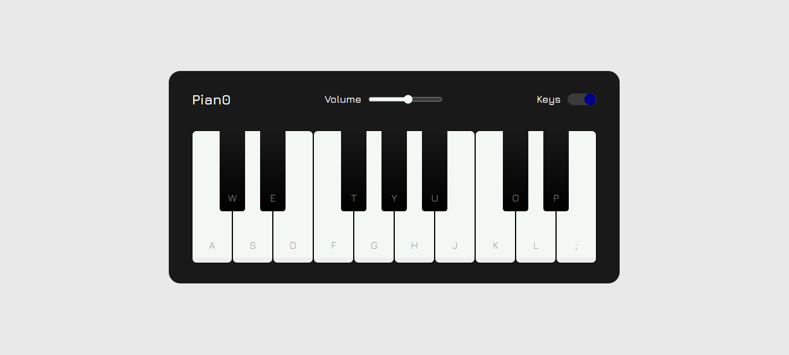

<h1 align="center"> Play Pian0. </h1>

Aplicação desenvolvida baseada no aplicativo Play Piano, disponível nas plataformas de download do seu smartphone.

  <a href="#-tecnologias">Tecnologias</a>&nbsp;&nbsp;&nbsp;|&nbsp;&nbsp;&nbsp;
  <a href="#-projeto">Projeto</a>&nbsp;&nbsp;&nbsp;

 

  

## 🚀 Tecnologias

Esse projeto foi desenvolvido com as seguintes tecnologias:

- HTML e CSS
- JavaScript

## 💻 Pian0

Você pode visualizar o resultado clincando neste [LINK](https://kiqprado.github.io/Play-Piano/).

## 🗯️ Layout

 Este conteúdo foi retirado com adaptações sobre o seguinte [conteúdo](https://www.youtube.com/watch?v=Mv1ZYpo8q4g&t=219s).

---
 

  
  &nbsp;&nbsp;&nbsp;|&nbsp;&nbsp;&nbsp;
  
 

